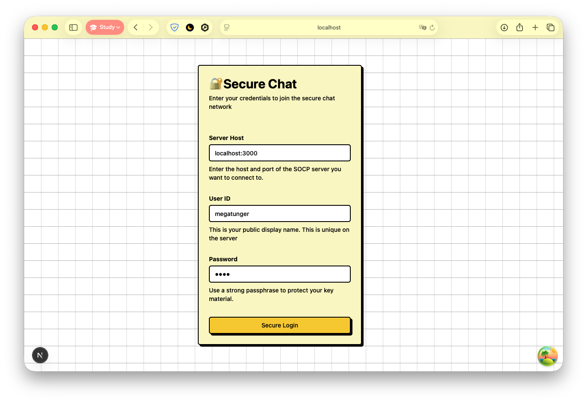
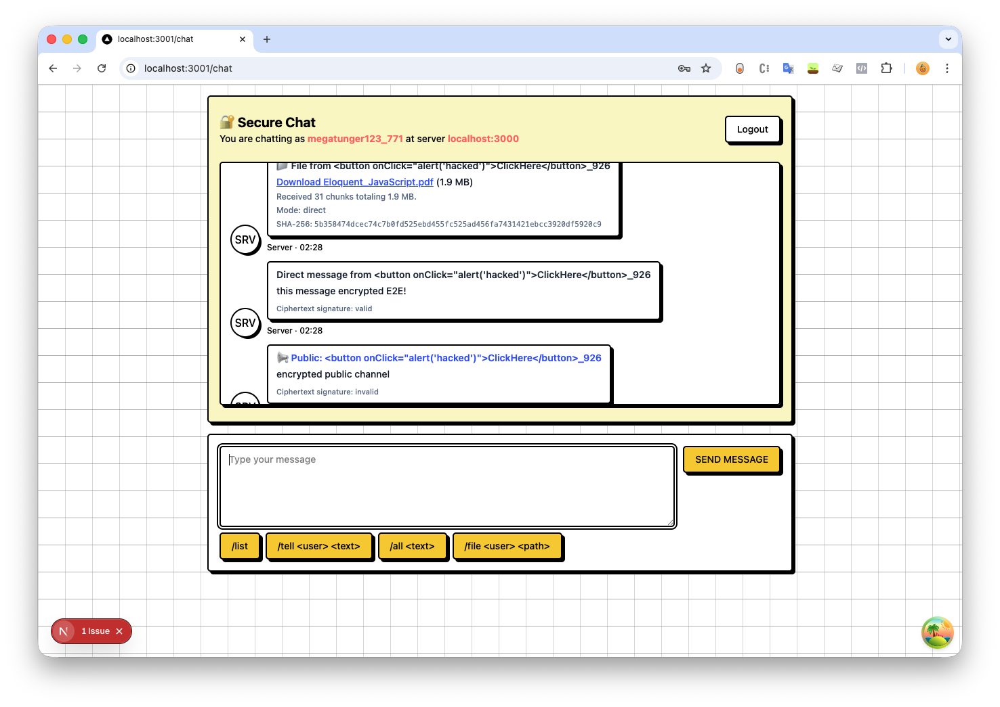

# Secure Overlay Chat Protocol – Group 29 Implementation




This repository contains the reference implementation of the Secure Overlay Chat Protocol (SOCP) v1.3 for Group 29. It
combines a Fastify-based backend (WebSocket) with a Next.js front-end, Prisma ORM, and SQLite storage to deliver
an end-to-end encrypted messaging.

Github Repository: [https://github.com/megatunger/g29-chat-protocol](https://github.com/megatunger/g29-chat-protocol)

---

## Main Contact Points:

For any issues on running the code, please reach out to:

1. **Son Tung Hoang: a1984077@adelaide.edu.au. Phone number: 0461269613 (Whatsapp, Text messages)**
2. Varuna Lingam. Phone number: 61481165397 (Whatsapp, Text messages)

## Group Members:

- Son Tung Hoang
- Varuna Lingam Pavalla Maharudramurthy
- Mustafa Tufan Keser
- Souvik Sarker
- Zhong Hong Su

---

## Expected Working Features

- ✅ UI Chat
- ✅ Register, joining chat
- ✅ Protect user private key by password
- ✅ Listing all online users
- ⚠️ Listing all online users between servers (works but please follow manual docs)
- ✅ E2E Direct Message
- ✅ Send direct message between servers
- ✅ File transfer between 2 users in the same server
- ❌ File transfer between 2 users in different servers
- ⚠️ Group Messaging is limited and may not follow protocol

---

## Prerequisites

- **Node.js** ≥ 22
- **yarn** as the package manager
- **SQLite**, included in package.json, but binaries may sometimes not build on your system.

When using a Node version manager (e.g., `nvm`), ensure `corepack enable` has been run if you prefer pnpm/yarn.

> **⚠️ PLEASE TAKE NOTE**: **Node.js 22+** is required to run this project. If you have an older version installed,
> please
> upgrade
> to meet this requirement.

---

## Backend Setup & Commands

```bash
# 1. Install dependencies
yarn install

# 2. Apply migrations & generate Prisma client
yarn prisma reset
yarn prisma migrate dev

# 3. Create private keys for backend server
yarn generate:key

# 4. Run the Fastify dev server (port 3000)
yarn dev

# If you need start another server (test server-server)
# yarn dev:server2

# 5. Inspect database records with Prisma Studio
yarn studio
```

## Front-end Setup & Commands

```bash
cd frontend

# Install Next.js dependencies
yarn install

# Run the development server (http://localhost:3001)
yarn dev

```

## How to test this application

> 👉 Please read the file **Guidelines.pdf**

## Repository Layout

```
├── app.js                  # Fastify bootstrapper (autoloads plugins/routes)
├── handlers/               # Opcode handlers (MSG_DIRECT, MSG_PUBLIC_CHANNEL, etc.)
├── plugins/                # Fastify plugins (CORS, security helpers, etc.)
├── routes/                 # HTTP and WebSocket routes (e.g., /chat)
├── utilities/              # Shared backend utilities (crypto helpers, registry)
├── prisma/
│   ├── schema.prisma       # Prisma schema (SQLite)
│   ├── migrations/         # Database migrations
│   └── dev.db              # Default SQLite database (generated)
├── generated/              # Prisma client output (do not edit)
├── frontend/               # Next.js 15 application (app router)
│   ├── src/app/            # Pages and layout
│   ├── src/contexts/       # React context providers (network, chat, auth)
│   ├── src/lib/            # Front-end crypto + protocol helpers
│   └── package.json        # Front-end dependencies/scripts
├── test/                   # Node --test suites
└── README.md               # This guide
```

Critical Folders / Module:

- `/handlers`: All the handlers in the backend for each type of messages
- `ChatContext.tsx`: All the handlers relating to messaging on frontend
- `*-crypto, *encryption`: Related to encryption
